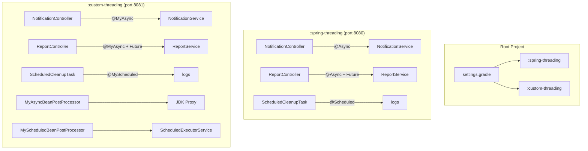

# Spring Boot Multithreading PoC

A proof-of-concept exploring how Spring's `@Async` and `@Scheduled` work under the hood by building two modules with identical APIs:

1. **`:spring-threading`** — uses Spring's built-in `@Async`, `@Scheduled`, `@EnableAsync`, `@EnableScheduling`
2. **`:custom-threading`** — replicates the same behavior with custom annotations (`@MyAsync`, `@MyScheduled`) backed by hand-rolled `BeanPostProcessor` + JDK dynamic proxy infrastructure

## Tech Stack

- Java 21
- Spring Boot 4.1
- Gradle multi-module

## Project Structure

```
java-multi-thread-poc/
├── build.gradle                  # Root — common config via subprojects {}
├── settings.gradle               # Includes :spring-threading and :custom-threading
├── scripts/
│   ├── test-spring-threading.sh  # Mac/Linux — test :spring-threading endpoints
│   ├── test-spring-threading.bat # Windows — test :spring-threading endpoints
│   ├── test-custom-threading.sh  # Mac/Linux — test :custom-threading endpoints
│   ├── test-custom-threading.bat # Windows — test :custom-threading endpoints
│   ├── test-both.sh              # Mac/Linux — run both test scripts
│   └── test-both.bat             # Windows — run both test scripts
├── spring-threading/
│   └── src/main/java/com/example/springthreading/
│       ├── SpringThreadingApplication.java   # @EnableAsync + @EnableScheduling
│       ├── config/AsyncConfig.java           # ThreadPoolTaskExecutor (4 threads)
│       ├── controller/
│       │   ├── NotificationController.java   # POST /notifications/send
│       │   └── ReportController.java         # POST /reports/generate, GET /reports/{id}
│       ├── service/
│       │   ├── NotificationService.java      # @Async void — fire-and-forget
│       │   └── ReportService.java            # @Async CompletableFuture — polling
│       ├── model/TaskStatus.java             # PENDING/COMPLETE + result
│       └── task/ScheduledCleanupTask.java    # @Scheduled(fixedRate = 10000)
└── custom-threading/
    └── src/main/java/com/example/customthreading/
        ├── CustomThreadingApplication.java         # Plain @SpringBootApplication (no @Enable*)
        ├── annotation/
        │   ├── MyAsync.java                        # Custom method-level annotation
        │   └── MyScheduled.java                    # Custom annotation with fixedRate attribute
        ├── infrastructure/
        │   ├── MyAsyncBeanPostProcessor.java       # Creates JDK proxy, dispatches to ExecutorService
        │   └── MyScheduledBeanPostProcessor.java   # Registers methods with ScheduledExecutorService
        ├── config/ThreadingConfig.java             # myAsyncExecutor (4 threads) + myScheduledExecutor (2 threads)
        ├── controller/
        │   ├── NotificationController.java
        │   └── ReportController.java
        ├── service/
        │   ├── NotificationService.java            # Interface (required for JDK proxy)
        │   ├── NotificationServiceImpl.java        # @MyAsync void
        │   ├── ReportService.java                  # Interface
        │   └── ReportServiceImpl.java              # @MyAsync CompletableFuture
        ├── model/TaskStatus.java
        └── task/ScheduledCleanupTask.java          # @MyScheduled(fixedRate = 10000)
```

## Running

```bash
# Spring module (port 8080)
./gradlew :spring-threading:bootRun

# Custom module (port 8081)
./gradlew :custom-threading:bootRun
```

## Testing with Scripts

Helper scripts in `scripts/` send sample payloads to all endpoints and show responses:

**Mac/Linux:**
```bash
bash scripts/test-spring-threading.sh    # test port 8080
bash scripts/test-custom-threading.sh    # test port 8081
bash scripts/test-both.sh               # run both
```

**Windows:**
```cmd
scripts\test-spring-threading.bat        REM test port 8080
scripts\test-custom-threading.bat        REM test port 8081
scripts\test-both.bat                    REM run both
```

The scripts exercise all three use cases:
1. Sends a fire-and-forget notification (expects 202)
2. Starts a report, polls immediately (expects PENDING), waits 6s, polls again (expects COMPLETE)
3. Requests an unknown task ID (expects 404)

## API Endpoints

Both modules expose the same endpoints on their respective ports:

### Fire-and-Forget

```bash
curl -X POST http://localhost:8080/notifications/send \
  -H "Content-Type: application/json" \
  -d '{"message": "hello"}'
# Returns 202 immediately, notification processes async (2s delay)
```

### Async with Polling

```bash
# Start report generation
curl -X POST http://localhost:8080/reports/generate
# Returns: {"taskId": "uuid-here"}

# Poll for result
curl http://localhost:8080/reports/<taskId>
# Returns: {"status": "PENDING", "result": ""}
# ... wait 5 seconds ...
# Returns: {"status": "COMPLETE", "result": "Report-uuid generated at ..."}
```

### Scheduled Task

No endpoint — observe the logs:
```
[spring-threading] Cleanup executed at 2024-01-15T10:00:00
[spring-threading] Cleanup executed at 2024-01-15T10:00:10
```

## How It Works

### Spring Module (the standard way)

| Annotation | Processed by | What happens |
|---|---|---|
| `@Async` | `AsyncAnnotationBeanPostProcessor` | Wraps bean in CGLIB proxy; proxy submits method calls to a `TaskExecutor` |
| `@Scheduled` | `ScheduledAnnotationBeanPostProcessor` | Registers methods with a `TaskScheduler` for periodic execution |

### Custom Module (our reimplementation)

| Annotation | Processed by | What happens |
|---|---|---|
| `@MyAsync` | `MyAsyncBeanPostProcessor` | Scans for annotated methods, wraps bean in JDK dynamic proxy, dispatches to `ExecutorService` |
| `@MyScheduled` | `MyScheduledBeanPostProcessor` | Scans for annotated methods, calls `scheduleAtFixedRate()` on `ScheduledExecutorService` |

### Key Differences

| Aspect | Spring | Custom |
|---|---|---|
| Proxy type | CGLIB (can proxy concrete classes) | JDK dynamic proxy (requires interface) |
| Async executor | `ThreadPoolTaskExecutor` (Spring wrapper) | Raw `ThreadPoolExecutor` |
| Scheduled executor | `ThreadPoolTaskScheduler` | Raw `ScheduledExecutorService` |
| Configuration | `@EnableAsync` / `@EnableScheduling` | BeanPostProcessors auto-detected via `@Component` |
| Error handling | `AsyncUncaughtExceptionHandler` | Simple logging in the proxy |

## Architecture Diagram



## Key Takeaways

1. **Spring's @Async is just a proxy + executor** — there's no magic. A `BeanPostProcessor` wraps your bean, and the proxy submits method calls to a thread pool.

2. **@Scheduled is even simpler** — no proxy needed. The BPP just registers your method for periodic invocation on a scheduler.

3. **Self-invocation bypass** — calling `this.sendNotification()` inside the same class skips the proxy entirely. This is a common gotcha with both Spring's and our custom implementation.

4. **JDK proxy requires interfaces** — our custom module demonstrates this constraint explicitly. Spring sidesteps it with CGLIB subclass proxying.

5. **Thread pool configuration matters** — an unbounded executor can starve your app. Both modules use bounded pools with named threads for observability.
