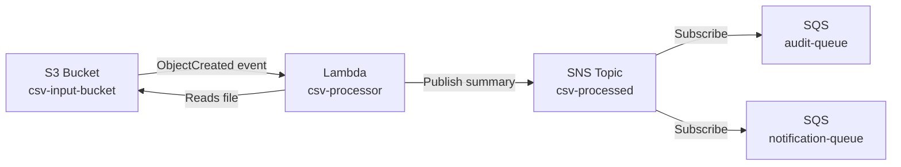

# Implementation Plan - Java POC: S3 → Lambda → SNS → 2 SQS (LocalStack + AWS)

## Problem Statement

Build a Java 17 proof-of-concept demonstrating an event-driven pipeline: an S3 upload triggers a Lambda that reads/parses a CSV file, publishes a summary to SNS, which fans out to two SQS queues (audit + notification). Must run locally on LocalStack v2 via Docker Compose and include instructions for real AWS deployment.

## Requirements

- Java 17 + Gradle (single module)
- AWS SDK v2 (`software.amazon.awssdk`)
- Lambda handler: S3Event trigger → download CSV → parse/summarize → publish to SNS
- SNS topic fans out to 2 SQS queues: `audit-queue` and `notification-queue`
- LocalStack v2 via Docker Compose for local development
- Shell scripts using `awslocal` for LocalStack and `aws` CLI for real AWS
- Instructions for both local and AWS deployment

## Architecture



## Proposed Solution

A single Gradle project with a Shadow JAR build. The Lambda uses the `RequestHandler<S3Event, String>` interface, configures SDK v2 clients with endpoint override support (env var driven) for LocalStack compatibility, and publishes a JSON summary message to SNS after parsing CSV rows. Infrastructure is set up via bash scripts — one for LocalStack (`setup-localstack.sh`) and one for AWS (`setup-aws.sh`). A Docker Compose file runs LocalStack v2.

## Task Breakdown

### Task 1: Project scaffolding and Gradle build setup

- **Objective:** Create the Gradle project structure with all dependencies and the Shadow JAR plugin configured.
- **Implementation guidance:**
  - Initialize `build.gradle` with Java 17, Shadow plugin (`com.github.johnrengelman.shadow` 8.1.1)
  - Add AWS SDK v2 BOM (2.25.60), `s3`, `sns` modules
  - Add `aws-lambda-java-core` (1.2.3) and `aws-lambda-java-events` (3.11.6)
  - Add a test dependency (JUnit 5)
  - Create `settings.gradle` with project name
  - Create standard `src/main/java` and `src/test/java` directory structure
- **Test requirements:** `./gradlew build` succeeds with no source errors
- **Demo:** Clean Gradle build produces a shadow JAR in `build/libs/`

### Task 2: Implement the CSV parsing utility

- **Objective:** Create a utility class that parses CSV content and produces a summary object.
- **Implementation guidance:**
  - Create `CsvParser` class in `com.example.processor` package
  - Input: `InputStream` or `String` of CSV content
  - Output: A `CsvSummary` POJO with fields like `rowCount`, `columnNames`, `fileName`, `firstFewRows` (List of Maps or similar)
  - Keep parsing simple — use `BufferedReader` + `String.split(",")` (no external CSV library needed for POC)
  - Create the `CsvSummary` record/class that can be serialized to JSON
- **Test requirements:** Unit tests with sample CSV content verifying correct row counts, column extraction, and edge cases (empty file, single row)
- **Demo:** Unit tests pass, showing CSV parsing works independently

### Task 3: Implement the SNS publishing service

- **Objective:** Create a service class that publishes a JSON message to an SNS topic.
- **Implementation guidance:**
  - Create `SnsPublisher` class in `com.example.processor` package
  - Constructor accepts `SnsClient` and `topicArn` (for testability)
  - Method `publishSummary(CsvSummary summary)` serializes to JSON and calls `snsClient.publish(...)`
  - Use Jackson (`ObjectMapper`) for JSON serialization — add `com.fasterxml.jackson.core:jackson-databind` dependency
  - The topic ARN should come from an environment variable (`SNS_TOPIC_ARN`)
- **Test requirements:** Unit test with a mocked `SnsClient` verifying `publish()` is called with expected JSON payload
- **Demo:** Unit tests pass, confirming SNS publish logic works in isolation

### Task 4: Implement the Lambda handler

- **Objective:** Wire together S3 reading, CSV parsing, and SNS publishing in the Lambda handler.
- **Implementation guidance:**
  - Create `CsvProcessorHandler` implementing `RequestHandler<S3Event, String>`
  - Build `S3Client` and `SnsClient` with endpoint override support:
    ```java
    String endpoint = System.getenv("AWS_ENDPOINT_URL");
    if (endpoint != null) builder.endpointOverride(URI.create(endpoint));
    ```
  - In `handleRequest`: extract bucket/key from S3Event records, download object via `s3Client.getObject(...)`, parse with `CsvParser`, publish with `SnsPublisher`
  - Use `forcePathStyle(true)` on S3 client for LocalStack compatibility
  - Log key steps using `context.getLogger()`
- **Test requirements:** Unit test with mocked S3Client and SnsClient, verifying the full flow from S3Event → parse → publish
- **Demo:** Unit tests pass, full handler logic verified end-to-end in isolation

### Task 5: Docker Compose and LocalStack setup script

- **Objective:** Create the local infrastructure setup for running the POC on LocalStack.
- **Implementation guidance:**
  - Create `docker-compose.yml` with LocalStack v2 (image `localstack/localstack:3.5`), port 4566, Docker socket mounted, `LAMBDA_EXECUTOR=docker-reuse`
  - Create `scripts/setup-localstack.sh` that:
    1. Waits for LocalStack to be healthy (`curl` health check loop)
    2. Creates S3 bucket (`csv-input-bucket`)
    3. Creates SNS topic (`csv-processed`)
    4. Creates 2 SQS queues (`audit-queue`, `notification-queue`)
    5. Subscribes both queues to the SNS topic
    6. Creates IAM role for Lambda
    7. Deploys Lambda from the shadow JAR with env vars (`AWS_ENDPOINT_URL=http://host.docker.internal:4566`, `SNS_TOPIC_ARN`)
    8. Configures S3 bucket notification to trigger the Lambda
  - All commands use `awslocal`
- **Test requirements:** Script is idempotent (can re-run without errors)
- **Demo:** `docker-compose up -d` + `./scripts/setup-localstack.sh` creates all resources; `awslocal s3 ls`, `awslocal sns list-topics`, `awslocal sqs list-queues` all show expected resources

### Task 6: End-to-end test script for LocalStack

- **Objective:** Create a script that uploads a CSV to S3, waits, and verifies messages arrive in both SQS queues.
- **Implementation guidance:**
  - Create `scripts/test-e2e.sh` that:
    1. Creates a sample CSV file (or uses a `samples/test.csv` committed to the repo)
    2. Uploads it to S3: `awslocal s3 cp samples/test.csv s3://csv-input-bucket/`
    3. Waits a few seconds for async processing
    4. Polls both SQS queues: `awslocal sqs receive-message --queue-url ...`
    5. Prints the messages and verifies non-empty (basic assertion via `jq`)
  - Create `samples/test.csv` with sample data (e.g., 5 rows of name,email,age)
- **Test requirements:** Script exits 0 on success, non-zero if messages not received
- **Demo:** Run the E2E script, see CSV summary messages in both audit and notification queues

### Task 7: AWS deployment instructions and script

- **Objective:** Provide a script and README for deploying to real AWS.
- **Implementation guidance:**
  - Create `scripts/setup-aws.sh` — same as LocalStack script but uses `aws` CLI (no endpoint override), uses real account ID, creates proper IAM role with policies (S3 read, SNS publish, CloudWatch logs)
  - Create `scripts/teardown-aws.sh` — cleans up all resources
  - Create `README.md` with:
    - Project overview and architecture diagram
    - Prerequisites (Java 17, Gradle, Docker, AWS CLI, awslocal)
    - Local development instructions (build → docker-compose up → setup → test)
    - AWS deployment instructions (build → setup-aws.sh → upload test file → verify)
    - Cleanup instructions
  - Note the difference: on AWS, Lambda uses default endpoints (no `AWS_ENDPOINT_URL` env var)
- **Test requirements:** README is clear and complete; AWS script is syntactically valid
- **Demo:** Complete README with both local and cloud deployment paths documented; AWS script ready to run
