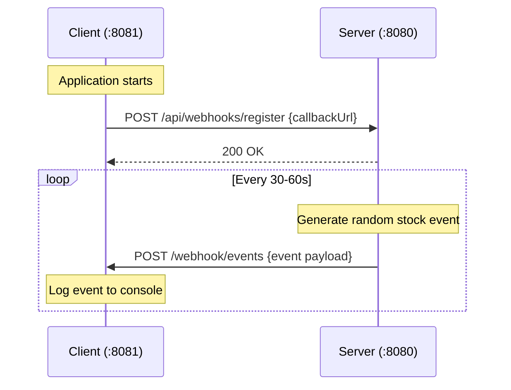

# Implementation Plan — Spring Boot Webhook PoC (Stock Ticker)

## Problem Statement
Build a webhook proof-of-concept with two Spring Boot applications. A server simulates stock price update events every 30-60 seconds and broadcasts them to all registered webhook clients. Clients auto-register on startup and log received events to the console.

## Requirements
- Server broadcasts stock ticker events to all registered clients
- Client auto-registers its callback URL with the server on startup
- Events fire every 30-60 seconds (configurable)
- Fire-and-forget delivery (log failures, don't retry)
- Stock ticker payload: `eventId`, `eventType`, `timestamp`, `data: {symbol, price, change, percentChange}`

## Architecture



## Proposed Solution
- **Server** exposes a registration endpoint, maintains an in-memory list of client URLs, uses `@Scheduled` to generate random stock ticker events, and dispatches them via `RestClient` to all registered clients.
- **Client** exposes a webhook receiver endpoint, and uses an `ApplicationRunner` to register itself with the server on boot.

## Task Breakdown

### Task 1: Server — Event model and registration endpoint
- **Objective:** Create the webhook event model (record classes) and a REST endpoint for clients to register their callback URL.
- **Implementation:**
  - Create `WebhookEvent` record with fields: `eventId` (UUID), `eventType` (String), `timestamp` (Instant), `data` (StockTickerData)
  - Create `StockTickerData` record with fields: `symbol`, `price`, `change`, `percentChange`
  - Create `WebhookRegistration` record with field: `callbackUrl`
  - Create `WebhookRegistrationController` with `POST /api/webhooks/register` that stores the callback URL in a thread-safe in-memory list
  - Create `WebhookRegistry` service (holds the `CopyOnWriteArrayList<String>` of URLs)
- **Test:** Write integration test that POSTs a registration and verifies 200 OK
- **Demo:** Start the server, `curl -X POST localhost:8080/api/webhooks/register -H "Content-Type: application/json" -d '{"callbackUrl":"http://localhost:8081/webhook/events"}'` returns 200

### Task 2: Server — Scheduled stock ticker event simulator
- **Objective:** Periodically generate random stock ticker events and broadcast to all registered clients.
- **Implementation:**
  - Create `StockEventSimulator` component with `@Scheduled(fixedDelayString = "${webhook.event.interval:45000}")` method
  - Maintain a list of stock symbols (AAPL, GOOGL, MSFT, AMZN, TSLA)
  - Generate random price (100-500), change (-5 to +5), and percentChange from those
  - Inject `WebhookRegistry` to get the list of registered URLs
  - Inject `RestClient` to POST the event payload to each registered URL
  - Fire-and-forget: wrap each dispatch in try/catch, log failures at WARN level
  - Add `@EnableScheduling` to the main application class
- **Test:** Unit test that the simulator generates valid event payloads; integration test with a mock endpoint
- **Demo:** Start server (no clients registered), observe log messages like "Generated event STOCK_PRICE_UPDATE for AAPL, 0 clients registered". Register a fake URL manually and see dispatch attempts logged.

### Task 3: Server — Configuration
- **Objective:** Configure the server application properly.
- **Implementation:**
  - Update `application.yaml`: set `server.port: 8080`, `spring.application.name: webhook-server`, add `webhook.event.interval: 45000`
  - Register a `RestClient` bean in a config class (or use `RestClient.create()` inline)
- **Test:** Application starts without errors
- **Demo:** Server boots on port 8080, logs show scheduling is active

### Task 4: Client — Webhook receiver endpoint
- **Objective:** Create a REST endpoint that receives webhook events and logs them.
- **Implementation:**
  - Add `spring-boot-starter-web` dependency to client's `build.gradle`
  - Create `WebhookReceiverController` with `POST /webhook/events` accepting the event JSON body
  - Log the full event at INFO level with a formatted message: `[STOCK EVENT] {symbol} ${price} ({change}, {percentChange}%) at {timestamp}`
  - Return 200 OK
- **Test:** Integration test posting a sample event payload and verifying 200 response
- **Demo:** Start client, `curl -X POST localhost:8081/webhook/events -H "Content-Type: application/json" -d '{"eventId":"...","eventType":"STOCK_PRICE_UPDATE","timestamp":"...","data":{"symbol":"AAPL","price":198.52,"change":1.23,"percentChange":0.62}}'` → logged to console

### Task 5: Client — Auto-registration with server on startup
- **Objective:** On boot, the client registers itself with the server's webhook registration endpoint.
- **Implementation:**
  - Create `WebhookRegistrationService` implementing `ApplicationRunner`
  - Use `RestClient` to POST `{"callbackUrl": "http://localhost:${server.port}/webhook/events"}` to `${webhook.server.url}/api/webhooks/register`
  - Log success/failure of registration
  - Add config in `application.yaml`: `server.port: 8081`, `spring.application.name: webhook-client`, `webhook.server.url: http://localhost:8080`
- **Test:** Integration test (mock server endpoint) verifying registration is attempted on startup
- **Demo:** Start server first, then client. Client logs "Successfully registered with webhook server at http://localhost:8080". Server logs "New webhook client registered: http://localhost:8081/webhook/events"

### Task 6: End-to-end integration
- **Objective:** Wire everything together and verify the full flow works.
- **Implementation:**
  - Ensure both apps compile and start cleanly
  - Verify the full cycle: client starts → registers → server generates event → client receives and logs it
  - Add any missing log statements for observability
- **Test:** Manual end-to-end test: start server, start client, wait 30-60s, observe stock ticker events logged in client console
- **Demo:** Both apps running. Client console shows stock price updates every ~45 seconds like:
  ```
  [STOCK EVENT] TSLA $342.17 (+2.45, +0.72%) at 2025-01-15T10:30:00Z
  ```
