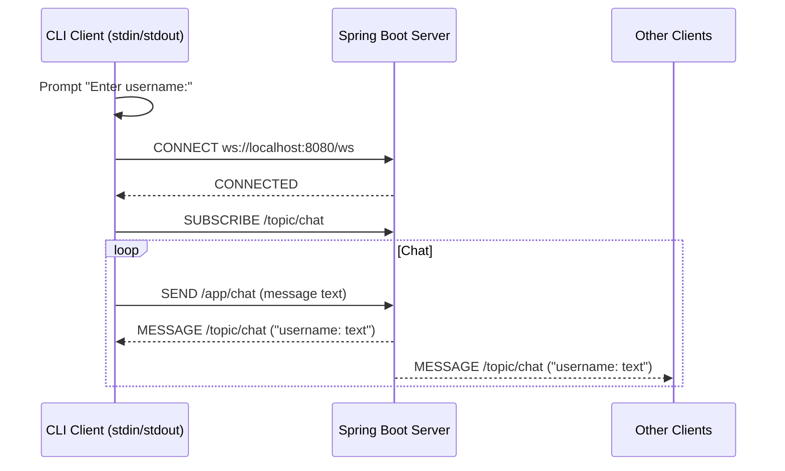

# Implementation Plan - Spring Boot WebSocket Chat PoC

## Problem Statement

Build a proof-of-concept chat application demonstrating Spring Boot STOMP-over-WebSocket communication between a dedicated server project and a standalone CLI client project.

## Requirements

- Server uses STOMP over WebSocket with Spring's message broker
- Single chat room, all messages broadcast to all subscribers
- Client is a Spring Boot CLI app that prompts for username, then enters a send/receive loop
- Messages displayed as `username: message text` (plain string)
- No persistence, no REST endpoints, no HTML frontend

## Background

- Both projects are already scaffolded as Spring Boot 4.1.0 / Java 21 / Gradle projects
- Package: `com.example.demo`, main class: `DemoApplication`
- Server needs `spring-boot-starter-websocket` dependency
- Client needs `spring-websocket` + `spring-messaging` + a WebSocket transport (Tyrus or standard Java WebSocket client)
- `WebSocketStompClient` with `StandardWebSocketClient` is the idiomatic Spring approach for a Java STOMP client

## Proposed Solution

## Task Breakdown

### Task 1: Configure the server project dependencies and WebSocket infrastructure

- **Objective:** Add WebSocket starter dependency and create the STOMP/WebSocket configuration class.
- **Implementation:**
  - Add `spring-boot-starter-websocket` to `build.gradle`
  - Create `WebSocketConfig` class implementing `WebSocketMessageBrokerConfigurer`
  - Register STOMP endpoint at `/ws` (no SockJS needed since client is Java)
  - Enable simple broker on `/topic`
  - Set application destination prefix to `/app`
- **Test:** Server starts without errors, WebSocket handshake endpoint is available at `ws://localhost:8080/ws`
- **Demo:** Server boots and logs show the STOMP endpoint is registered.

### Task 2: Implement the server chat message controller

- **Objective:** Create a controller that receives messages and broadcasts them to the topic.
- **Implementation:**
  - Create `ChatController` with `@MessageMapping("chat")` and `@SendTo("/topic/chat")`
  - Accept a simple `String` payload (the raw message text)
  - Return the formatted string to be broadcast (at this stage, just echo back the message — username prefixing will come from the client sending `"username: text"`)
- **Test:** Unit test the controller method — given input string, returns same string. Verify with `@SpringBootTest` that the app context loads.
- **Demo:** Server boots, context loads with the message mapping registered.

### Task 3: Configure the client project dependencies

- **Objective:** Add required WebSocket/STOMP client dependencies to the client `build.gradle`.
- **Implementation:**
  - Add `spring-websocket`, `spring-messaging` dependencies
  - Add `org.glassfish.tyrus.bundles:tyrus-standalone-client:2.1.5` (or Jakarta WebSocket standard client) as the WebSocket transport
  - Confirm the project compiles cleanly
- **Test:** `./gradlew build` succeeds with no errors.
- **Demo:** Client project compiles with all WebSocket dependencies resolved.

### Task 4: Implement the CLI client STOMP session and message handling

- **Objective:** Build the client that connects to the server, subscribes to `/topic/chat`, and prints incoming messages.
- **Implementation:**
  - Modify `DemoApplication` to implement `CommandLineRunner` (or create a separate runner bean)
  - On startup: prompt for username via `System.console()` or `Scanner(System.in)`
  - Create `StandardWebSocketClient` → `WebSocketStompClient`
  - Connect to `ws://localhost:8080/ws`
  - In the `StompSessionHandler.afterConnected()`, subscribe to `/topic/chat`
  - In the subscription's `FrameHandler`, print received messages to stdout
  - After connecting, enter a loop reading lines from stdin, sending each as `"username: line"` to destination `/app/chat`
  - Handle disconnect/errors gracefully (print error, exit)
- **Test:** Integration test — start server, start client, send a message, verify it's echoed back. (Manual verification is acceptable for the PoC; optionally a `@SpringBootTest` that wires up the client and verifies connectivity.)
- **Demo:** Start the server, start one or two client instances in separate terminals. Type messages in one client, see them appear in both.

### Task 5: End-to-end verification and polish

- **Objective:** Ensure the full flow works and handle edge cases gracefully.
- **Implementation:**
  - Verify multi-client broadcast (two CLI clients see each other's messages)
  - Add graceful shutdown: when user types `/quit` or presses Ctrl+C, disconnect cleanly
  - Add `application.properties` to server with `server.port=8080` explicitly
  - Add `spring.main.web-application-type=none` to client's `application.properties` (no embedded web server)
  - Update `settings.gradle` in both projects to use meaningful names (`java-websocket-poc-server` / `java-websocket-poc-client`)
- **Test:** Full manual test — server running, two clients connect, exchange messages, one quits cleanly.
- **Demo:** Complete working chat session between two terminal windows with clean startup and shutdown.
