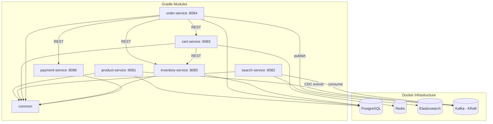

# Implementation Plan - E-Commerce PoC (Multi-Module Gradle, Docker-Local)

## Problem Statement

Build a proof-of-concept of the core e-commerce system described in the design reference — 6 independent Spring Boot services communicating via REST and Kafka, backed by PostgreSQL, Redis, Elasticsearch, and Kafka, all running locally in Docker. Payment processing is mocked in-memory. The checkout flow implements the full Saga pattern with compensating actions.

## Requirements

- 6 separate Gradle modules: Product, Search, Cart, Order, Inventory, Payment
- Shared `common` module for DTOs and event contracts
- Inter-service communication: REST (sync) + Kafka (async events)
- Infrastructure: single PostgreSQL (separate schemas per service), Redis, Elasticsearch, Kafka (KRaft) — all in Docker Compose
- Full Saga pattern for checkout: inventory reservation with TTL, mocked payment, compensation on failure
- Mocked payment processor: in-memory mock behind an interface (configurable success/failure)
- No frontend, no API gateway
- Spring Boot 4.1, Java 21, Gradle 9.5.1

## Architecture



## Project Layout

```
spring-boot-ecommerce-poc/
├── build.gradle                  (root: shared config, plugins with apply false)
├── settings.gradle               (includes all modules)
├── compose.yaml                  (shared Docker Compose for local dev)
├── docker/
│   └── init-db.sql               (creates per-service schemas)
├── common/
│   ├── build.gradle              (plain java lib, no boot plugin)
│   └── src/main/java/com/example/common/
│       ├── dto/
│       ├── event/
│       └── util/
├── product-service/
│   ├── build.gradle
│   ├── Dockerfile
│   └── src/
│       ├── main/java/com/example/product/
│       │   └── ProductServiceApplication.java
│       └── main/resources/application.yaml  (server.port=8081)
├── search-service/               (server.port=8082)
├── cart-service/                  (server.port=8083)
├── order-service/                (server.port=8084)
├── inventory-service/            (server.port=8085)
└── payment-service/              (server.port=8086)
```

## Task Breakdown

---

### Task 1: Project scaffolding and multi-module Gradle setup

**Objective:** Transform the single-module project into a proper multi-module Gradle structure with 7 submodules (common + 6 services), each configured correctly.

**Implementation guidance:**
- Restructure `settings.gradle` to include all 7 modules
- Refactor root `build.gradle` to use `apply false` for Spring Boot plugin, shared config via `subprojects` block
- Create `common/build.gradle` as a plain Java library (no Boot plugin)
- Create each service module's `build.gradle` with the Spring Boot plugin applied and `implementation project(':common')`
- Create a minimal `@SpringBootApplication` class in each service with distinct `server.port` (8081-8086)
- Create `application.yaml` per service with port and service name
- Remove the old `src/` directory

**Test requirements:**
- Each module compiles successfully (`./gradlew build`)
- Each service starts and responds to a health check (Spring Boot Actuator `/actuator/health`)

**Demo:** Run `./gradlew build` — all 7 modules compile. Start any individual service and hit its health endpoint.

---

### Task 2: Docker Compose infrastructure setup

**Objective:** Create a `compose.yaml` at the project root that runs PostgreSQL, Redis, Elasticsearch, and Kafka (KRaft mode) locally. Configure Spring Boot Docker Compose integration.

**Implementation guidance:**
- `compose.yaml` with services:
  - `postgres` (v16, with init scripts to create schemas)
  - `redis` (v7)
  - `elasticsearch` (v8.x, single-node, security disabled)
  - `kafka` (KRaft mode via `apache/kafka` or `confluentinc/cp-kafka` with `KAFKA_PROCESS_ROLES=broker,controller` — no Zookeeper container)
- PostgreSQL init script (`docker/init-db.sql`) that creates schemas: `product_schema`, `order_schema`, `inventory_schema`
- Add `spring-boot-docker-compose` as `developmentOnly` dependency in each service
- Configure each service's `application.yaml` to point at the correct schema and infrastructure ports
- Add `spring-boot-starter-actuator` to all services

**Test requirements:**
- `docker compose up` starts all 4 infrastructure containers and they become healthy
- Starting a service with the Docker Compose integration auto-discovers and connects to infrastructure

**Demo:** Run `docker compose up -d`, then start any service — it connects to PostgreSQL/Redis without manual config.

---

### Task 3: Common module — shared DTOs, events, and utilities

**Objective:** Build the `common` module with shared data contracts that all services will use for REST communication and Kafka events.

**Implementation guidance:**
- DTOs: `ProductDTO`, `CartDTO`, `CartItemDTO`, `OrderDTO`, `OrderItemDTO`, `InventoryDTO`
- Event classes: `OrderCreatedEvent`, `OrderCancelledEvent`, `ProductUpdatedEvent`
- Request/Response objects: `AddToCartRequest`, `CreateOrderRequest`, `ReserveInventoryRequest`, `PaymentRequest`, `PaymentResponse`
- Error response model: `ApiError` with code, message, and field-level details
- Enums: `OrderStatus` (PENDING, CONFIRMED, PROCESSING, SHIPPED, DELIVERED, CANCELLED), `PaymentStatus` (SUCCESS, FAILED, PENDING)
- ID generator utility

**Test requirements:**
- Unit tests for any utility logic (ID generator)
- DTOs serialize/deserialize correctly with Jackson

**Demo:** `./gradlew :common:build` passes. Other modules can import and use the shared types.

---

### Task 4: Product Service — catalog management with PostgreSQL

**Objective:** Implement the Product Service that manages the product catalog with CRUD operations and exposes REST APIs.

**Implementation guidance:**
- Entity: `Product` (id, name, description, category, price, imageUrl, rating, reviewCount, sellerId, attributes as JSON, createdAt, updatedAt)
- Repository: Spring Data JPA with `ProductRepository`
- Service layer: `ProductService` with CRUD + list by category
- REST endpoints: `GET /products/{id}`, `GET /products` (paginated, filterable by category)
- Use `product_schema` in PostgreSQL
- Seed data: preload 10-20 sample products on startup via `data.sql` or `CommandLineRunner`
- Redis caching: cache product lookups with `@Cacheable` (Spring Cache with Redis)

**Test requirements:**
- Integration test: create product, fetch by ID, verify response
- Integration test: list products with category filter
- Test cache behavior: second fetch hits cache (verify with spy/metrics)

**Demo:** Start Product Service, call `GET /products` — returns paginated product list. Call `GET /products/{id}` — returns product detail. Second call is served from Redis cache.

---

### Task 5: Inventory Service — stock management with optimistic locking

**Objective:** Implement the Inventory Service that tracks stock levels, supports availability checks, and handles reservations with TTL-based expiry.

**Implementation guidance:**
- Entity: `Inventory` (id, productId, warehouseId, availableQty, reservedQty, version, updatedAt)
- Entity: `Reservation` (id, productId, quantity, status [ACTIVE/CONFIRMED/EXPIRED], expiresAt, orderId, createdAt)
- Repository with `@Version` for optimistic locking
- Service layer: `InventoryService` — checkAvailability, reserveInventory (with TTL), confirmReservation, releaseReservation
- REST endpoints: `GET /inventory/{productId}/availability`, `POST /inventory/reserve`, `POST /inventory/confirm`, `POST /inventory/release`
- Scheduled task: expire stale reservations (every 60s, release reservations past their TTL)
- Seed data: inventory records for all sample products

**Test requirements:**
- Integration test: reserve inventory → available qty decreases, reserved qty increases
- Integration test: reservation expires after TTL → stock released
- Integration test: concurrent reservation attempts with optimistic locking (verify no overselling)
- Integration test: confirm reservation → deducts from reserved, does not restore to available

**Demo:** Call availability check — shows stock. Reserve 5 units — available drops by 5. Wait for TTL expiry — stock is restored. Reserve and confirm — stock permanently reduced.

---

### Task 6: Cart Service — Redis-backed shopping cart

**Objective:** Implement the Cart Service that manages shopping carts stored in Redis, with inventory validation on add.

**Implementation guidance:**
- Model: Cart stored as Redis Hash (key: `cart:{userId}`, fields: productId → JSON with quantity, productName, unitPrice)
- Service layer: `CartService` — addItem, updateItem, removeItem, getCart, clearCart
- REST endpoints: `POST /cart/{userId}/items`, `PUT /cart/{userId}/items/{productId}`, `DELETE /cart/{userId}/items/{productId}`, `GET /cart/{userId}`, `DELETE /cart/{userId}`
- On `addItem`: call Inventory Service (REST) to validate availability before adding
- Cart TTL: 24 hours in Redis (refreshed on each modification)
- Use Spring Data Redis with `RedisTemplate`

**Test requirements:**
- Integration test: add item to cart → cart contains item with correct details
- Integration test: add item when out of stock → returns 409 Conflict
- Integration test: update quantity, remove item, get cart
- Integration test: cart expires after TTL (use short TTL in test)

**Demo:** Add items to cart (validates inventory), view cart, update quantity, remove item. Try adding out-of-stock item — get error.

---

### Task 7: Payment Service — mocked payment processor

**Objective:** Implement the Payment Service with an in-memory mock that simulates an external payment gateway, supporting configurable success/failure scenarios.

**Implementation guidance:**
- Interface: `PaymentProcessor` with `charge(PaymentRequest)` and `refund(String paymentId)`
- Mock implementation: `MockPaymentProcessor` — configurable via properties to simulate:
  - Success (default)
  - Random failure (configurable failure rate %)
  - Specific card number triggers failure (e.g., card ending in `0000` always fails)
  - Configurable latency (simulates network delay)
- Entity: `PaymentRecord` (id, orderId, amount, currency, status, cardLast4, createdAt) — persisted to PostgreSQL for auditability
- Service layer: `PaymentService` — processPayment, refundPayment
- REST endpoints: `POST /payments/charge`, `POST /payments/refund/{paymentId}`, `GET /payments/{paymentId}`
- Idempotency: store idempotency key → if same key arrives twice, return cached result

**Test requirements:**
- Unit test: mock processor returns success/failure based on configuration
- Integration test: charge → returns payment ID and SUCCESS status
- Integration test: charge with "bad card" → returns FAILED
- Integration test: idempotent retry → same result returned without double processing
- Integration test: refund → status changes to REFUNDED

**Demo:** Call charge endpoint — get success. Call with bad card — get failure. Retry same idempotency key — get cached response. Refund a charge — refund confirmed.

---

### Task 8: Order Service — Saga-based checkout orchestration

**Objective:** Implement the Order Service that orchestrates the full checkout flow using the Saga pattern with compensating actions for every failure scenario.

**Implementation guidance:**
- Entity: `Order` (id, userId, status, subtotal, tax, shippingFee, total, shippingAddressId, paymentId, idempotencyKey, createdAt, updatedAt)
- Entity: `OrderItem` (id, orderId, productId, productName, quantity, unitPrice, subtotal)
- Order state machine: PENDING → CONFIRMED → PROCESSING → SHIPPED → DELIVERED / CANCELLED
- Saga orchestrator: `CheckoutSaga` class that coordinates:
  1. Fetch cart from Cart Service (REST)
  2. Reserve inventory via Inventory Service (REST)
  3. Process payment via Payment Service (REST)
  4. Create order record (local DB)
  5. Confirm inventory reservation (REST)
  6. Clear cart (REST)
  7. Publish `OrderCreatedEvent` to Kafka
- Compensation logic:
  - If payment fails → release inventory reservation
  - If order creation fails → refund payment + release inventory
  - If confirmation fails → log for manual retry (order is still valid)
- REST endpoints: `POST /orders`, `GET /orders/{orderId}`, `GET /orders/user/{userId}`
- Idempotency: unique `idempotencyKey` per order — reject duplicates

**Test requirements:**
- Integration test: happy path — full checkout succeeds, order created, inventory confirmed, cart cleared
- Integration test: payment failure — inventory released, no order created, appropriate error returned
- Integration test: inventory unavailable — immediate failure, no payment attempted
- Integration test: idempotency — same request twice → same order returned
- Integration test: order status retrieval

**Demo:** Full checkout flow via REST calls: add items to cart → place order → order confirmed. Trigger payment failure → verify inventory released. Check order status and history.

---

### Task 9: Search Service — Elasticsearch integration with product indexing

**Objective:** Implement the Search Service that indexes products into Elasticsearch (via Kafka CDC events) and exposes a search API with filtering and ranking.

**Implementation guidance:**
- Elasticsearch document: product ID, name, description, category, price, rating, reviewCount, sellerId
- Kafka consumer: listens to `product-events` topic, indexes/updates products in Elasticsearch
- Product Service: publishes `ProductUpdatedEvent` to Kafka on product create/update (simple CDC — no Debezium for PoC, just application-level events)
- Search API: `GET /products/search?query=&category=&minPrice=&maxPrice=&minRating=&sortBy=&page=&limit=`
- Elasticsearch query: multi-match on name+description, with filters for category, price range, rating
- Basic relevance scoring: boost title matches over description matches
- On startup: if index is empty, trigger a full reindex from Product Service (REST call to get all products)

**Test requirements:**
- Integration test: index a product, search by keyword → found
- Integration test: filter by category, price range, rating
- Integration test: product update event → search reflects new data
- Integration test: search with no results → empty response

**Demo:** Search for "headphones" — get matching products. Filter by price range — results narrow. Update a product's name via Product Service → search reflects the change (via Kafka event).

---

### Task 10: Kafka event publishing and async processing

**Objective:** Wire up Kafka event publishing from Order Service and consumption for downstream processing (notification logging, fulfillment logging). Connect Product Service events to Search Service indexing.

**Implementation guidance:**
- Kafka topics: `order-events`, `product-events`
- Order Service: publish `OrderCreatedEvent` and `OrderCancelledEvent` after saga completion
- Product Service: publish `ProductUpdatedEvent` on product create/update/delete
- Search Service: consume `product-events` to keep Elasticsearch index in sync (already from Task 9)
- Create a simple `notification-listener` component (can live in Order Service or as a separate `@Component`) that consumes `order-events` and logs "Email sent to user X for order Y" (simulates notification)
- Spring Kafka producer/consumer configuration in each relevant service's `application.yaml`
- Error handling: DLT (Dead Letter Topic) for failed messages

**Test requirements:**
- Integration test: place order → `OrderCreatedEvent` published → notification listener logs it
- Integration test: create product → `ProductUpdatedEvent` published → Search Service indexes it
- Integration test: message deserialization failure → routed to DLT

**Demo:** Place an order end-to-end. Check Order Service logs — see event published. Check notification listener logs — see "email sent" message. Create a product — verify it appears in search within seconds.

---

### Task 11: End-to-end integration test and Docker Compose full-stack run

**Objective:** Create a full end-to-end integration test that exercises the entire purchase flow from product discovery through order completion, and ensure all 6 services run together via Docker Compose.

**Implementation guidance:**
- Create a `docker-compose.services.yaml` (or extend `compose.yaml`) that builds and runs all 6 services as Docker containers alongside the infrastructure
- Add `Dockerfile` to each service module (multi-stage: Gradle build → JRE runtime)
- End-to-end test (can be a separate test module or script using `RestTemplate`/`WebClient`):
  1. Search for products → get results
  2. Get product details → verify data
  3. Add to cart → verify cart state
  4. Place order → verify success (inventory reserved, payment charged, order created)
  5. Verify order status
  6. Verify inventory reduced
  7. Verify cart cleared
- Test failure scenarios:
  - Out of stock → order fails gracefully
  - Payment failure → inventory released
- Add a README with instructions to run the full stack

**Test requirements:**
- Full end-to-end test passes when all services and infrastructure are running
- Failure scenarios produce correct compensating behavior
- All services start within Docker Compose and communicate correctly

**Demo:** `docker compose up` — entire system comes up. Run the E2E test suite — all scenarios pass. Show the full purchase journey in logs across services.
